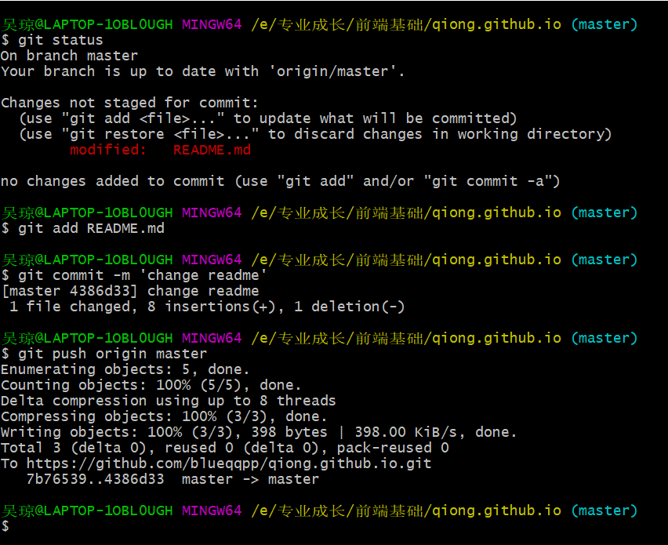

# qiong.github.io

##  首次使用时

###  先克隆到本地，然后以后就在这个里面修改，提交即可。



###  创建SSH KEY 

 ####  先看一下你C盘用户目录下有没有.ssh目录，有的话看下里面有没有id_rsa和id_rsa.pub这两个文件，有就跳到下一步，没有就通过下面命令创建 

```
$ ssh-keygen -t rsa -C "youremail@example.com"
```

####   然后一路回车。这时你就会在用户下的.ssh目录里找到id_rsa和id_rsa.pub这两个文件   


#### 登录Github,找到右上角的图标，打开点进里面的Settings，再选中里面的SSH and GPG KEYS，点击右上角的New SSH key，然后Title里面随便填，再把刚才id_rsa.pub里面的内容复制到Title下面的Key内容框里面，最后点击Add SSH key，这样就完成了SSH Key的加密。

###  当图片不显示时

####  修改hosts

C:\Windows\System32\drivers\etc\hosts

在文件末尾添加：

```
# GitHub Start 
192.30.253.112    Build software better, together 
192.30.253.119    gist.github.com
151.101.184.133    assets-cdn.github.com
151.101.184.133    raw.githubusercontent.com
151.101.184.133    gist.githubusercontent.com
151.101.184.133    cloud.githubusercontent.com
151.101.184.133    camo.githubusercontent.com
151.101.184.133    avatars0.githubusercontent.com
151.101.184.133    avatars1.githubusercontent.com
151.101.184.133    avatars2.githubusercontent.com
151.101.184.133    avatars3.githubusercontent.com
151.101.184.133    avatars4.githubusercontent.com
151.101.184.133    avatars5.githubusercontent.com
151.101.184.133    avatars6.githubusercontent.com
151.101.184.133    avatars7.githubusercontent.com
151.101.184.133    avatars8.githubusercontent.com

 # GitHub End
```

###  在github发布网站

1. 首先， [注册一个GitHub账号，](https://github.com/join) 并确认你的邮箱地址。

2. 接下来，你需要创建一个新的资源库( repository )来存放你的文件。

3. 在这个页面上，在 *Repository name* 输入框里输入 *username*.github.io，username 是你的用户名。比如，我们的朋友 bobsmith 会输入 *bobsmith.github.io。同时勾选* *Initialize this repository with a README* ，然后点击 *Create repository*。

4. 然后，将你的网站文件夹里的内容拖拽到你的资源库( repository )，再点击 

   Commit changes

   **提示**: 确保你的文件夹有一个 *index.html* 文件.

5. 现在将你的浏览器转到 *username*.github.io 来在线查看你的网站。比如，*如果用户名为chrisdavidmills*, 请转到 [chrisdavidmills.github.io](http://chrisdavidmills.github.io/)。

6. 可点击settings，里面会有pages的信息。 Your site is published at https://blueqqpp.github.io/qiong.github.io/ 。


